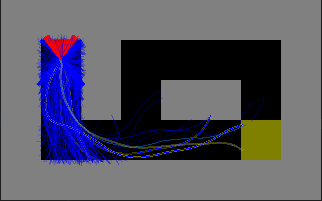

Works on:
- Ubuntu 20.04
- Python 3.8.5
- OpenAI gym 0.17.3
- mujoco 200
- mujoco_py 2.0.2.13
- nvidia driver 450 / 460
- CUDA 10.1
- Tensorflow 2.3.1
- pyglet 1.5.14

# Steps to reproduce my experiments:
- Install above dependencies
- Pull this repository
- Run AlgEvo.py
- VSCode is recommended - AlgEvo.py can be opened as a notebook and see plots in interactive window
- Training can be safely interrupted with Ctrl+C in console or red square in VSCode and plots will still be produced

[Hackmd for tracking progress](https://hackmd.io/NUtcNODST3SHuBCEYfpFUg?view)

# RLCar-v0
## Rays

## Trajectories

Blue lines: Evo Actors
Red lines: RL Actor

Worst issue: RL Actor doesn't learn any sensible strategy