Works on:
- Ubuntu 20.04
- Python 3.8.5
- OpenAI gym 0.17.3
- mujoco 200
- mujoco_py 2.0.2.13
- nvidia driver 450 / 460
- CUDA 10.1
- Tensorflow 2.3.1

# Steps to reproduce my experiments:
- Install above dependencies
- Pull this repository
- Run all cells in the AlgEvo.ipynb notebook

[Hackmd for tracking progress](https://hackmd.io/NUtcNODST3SHuBCEYfpFUg?view)

# InvertedPendulum-v2
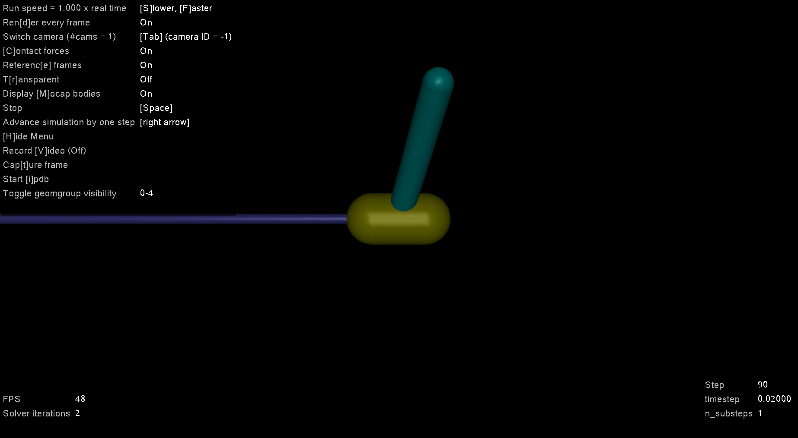

## DDPG Algorithm
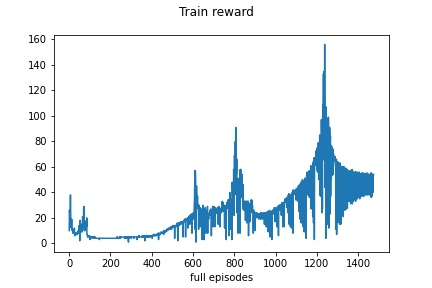
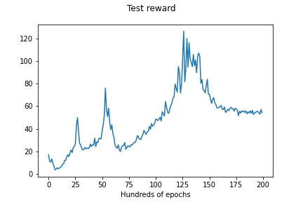
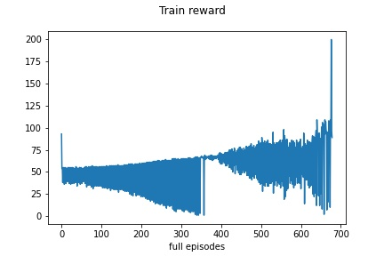
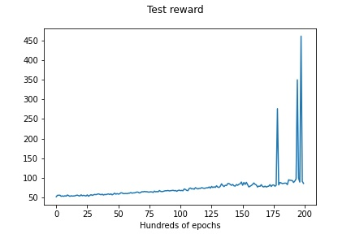

## ERL Algorithm (Train reward 10x too high)
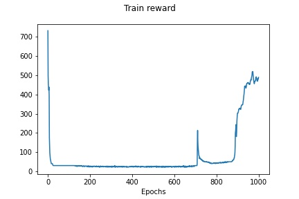
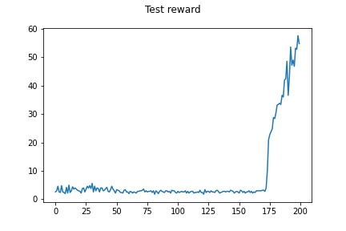
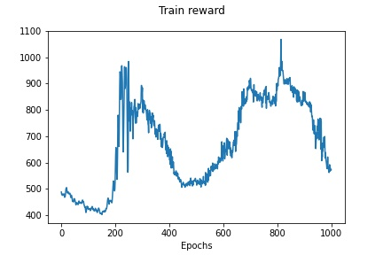
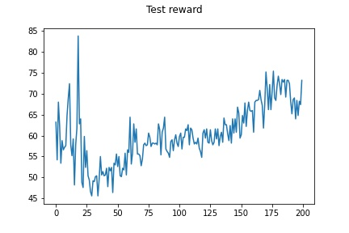
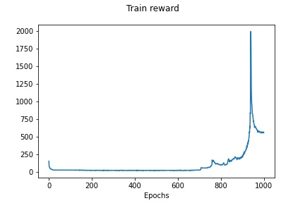
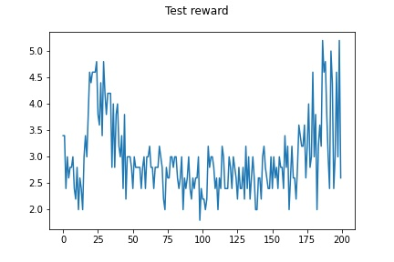
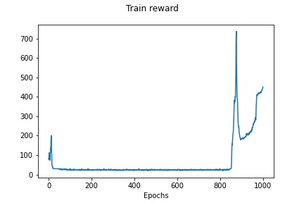
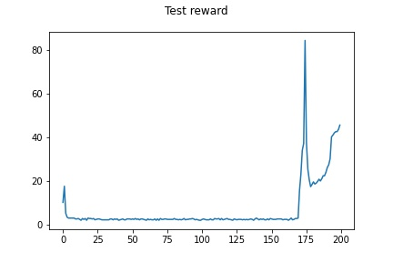
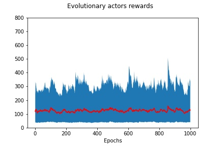

## Previous experiments (DDPG)

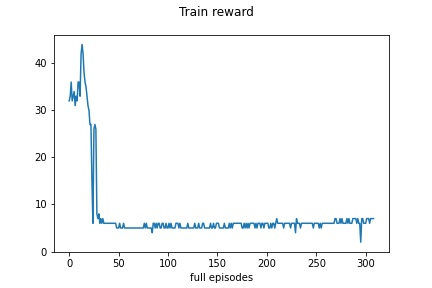
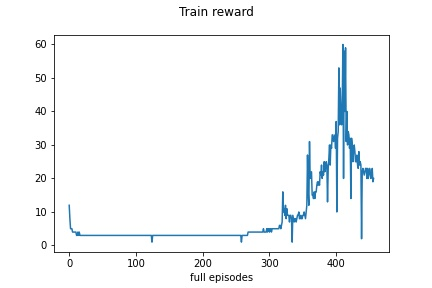

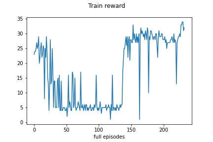

### 4x times more epochs, action noise scaled logarythmically
### 0.1 -> 0.001:
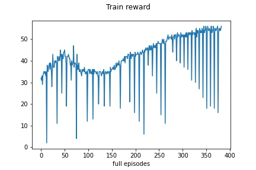

### 0.001 -> 0.0001
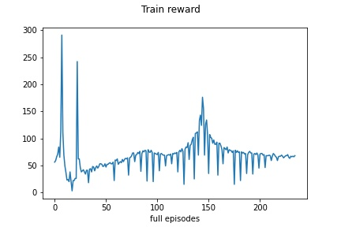

### 0.1 -> 0.0001, 20000 epochs
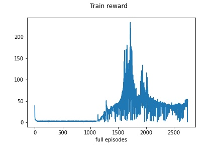

## Test reward plots:

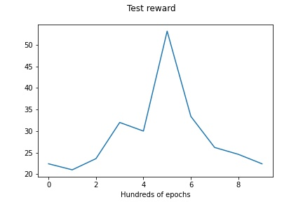
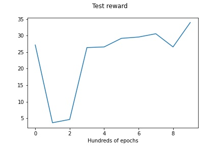

### 4x times more epochs, action noise scaled logarythmically
### 0.1 -> 0.001:
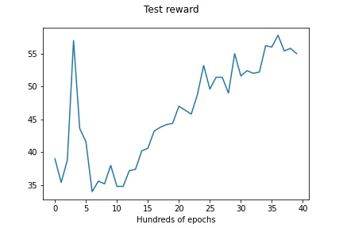

### 0.001 -> 0.0001
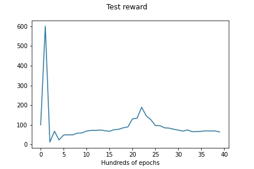

### 0.1 -> 0.0001, 20000 epochs
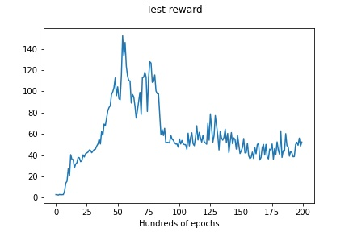

One test run had 2000 steps
