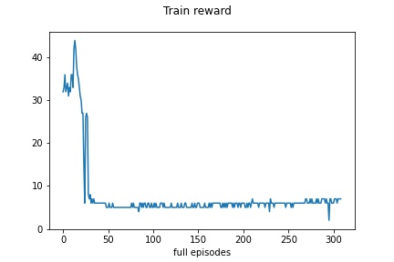
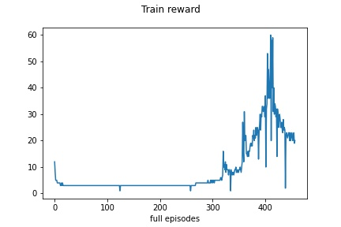
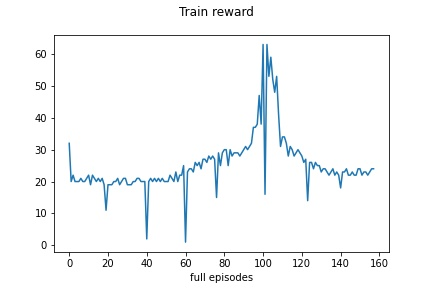
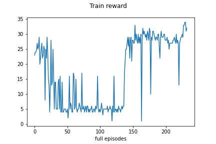
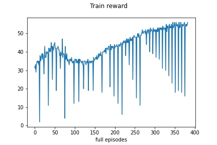
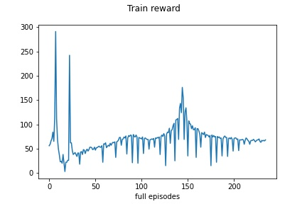
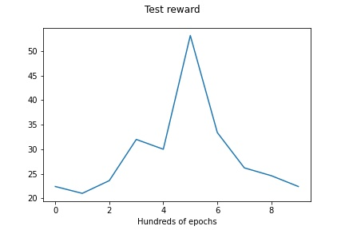
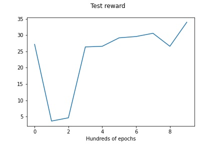
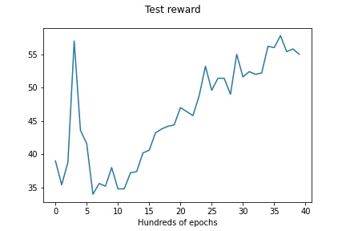
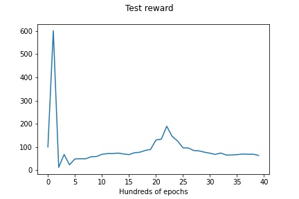

Works on:
- Ubuntu 20.04
- Python 3.8.5
- OpenAI gym 0.17.3
- mujoco 200
- mujoco_py 2.0.2.13
- nvidia driver 450
- CUDA 10.1
- Tensorflow 2.3.1

[Hackmd for tracking progress](https://hackmd.io/NUtcNODST3SHuBCEYfpFUg?view)

# DDPG Algorithm
## InvertedPendulum-v2
## Training reward plots:

### 4x times more epochs, action noise scaled logarythmically
### 0.1 -> 0.001:

### 0.001 -> 0.0001

## Test reward plots:

### 4x times more epochs, action noise scaled logarythmically
### 0.1 -> 0.001:

### 0.001 -> 0.0001

One test run had 2000 steps
